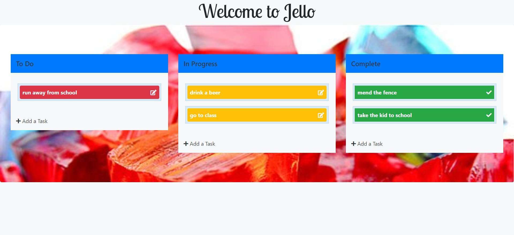
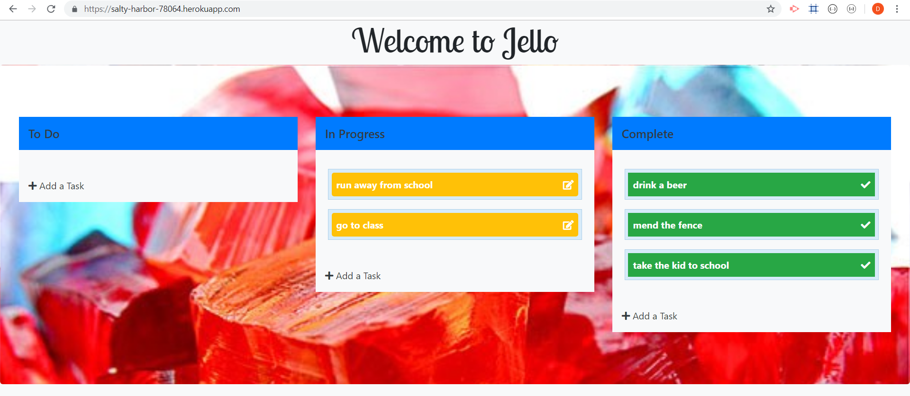
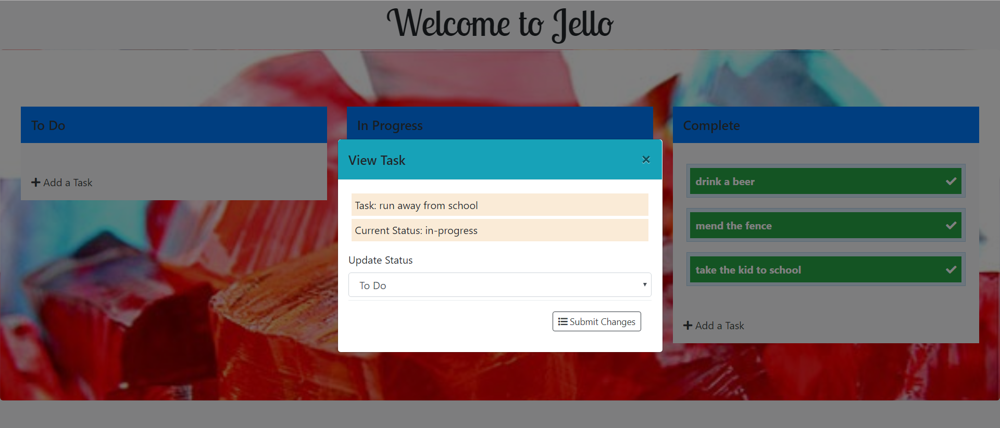
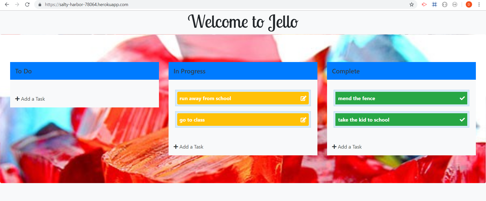

# GroupProject2
## Jello

-This app was created as a task organizer app for grandma to use.  
-We created this app to be as userfriendly as possible so anyone from any age range can use is.  
-you start by adding a task in the to do section.  After this you are able to drag and drop the task from column to column weather it be in the in progress column or the completed column.  If you do not want to use drag and drop we have option for you to click on the task and able to navigate where you need it to go from there.
### Check out our app here.
https://salty-harbor-78064.herokuapp.com/

